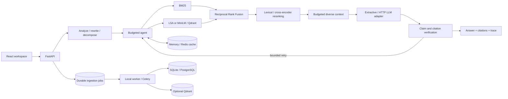

# MRAG

For the Vercel multi-service deployment, see [the deployment guide](docs/vercel.md).

### Production Agentic Knowledge & Research System

**An evidence-first research workspace with explicit retrieval algorithms,
bounded tools, inspectable citations, and reproducible experiments.**

MRAG makes the engineering behind an answer visible: which queries were
searched, how candidates were ranked, which evidence made the context, what a
tool did, and whether returned claims have direct source support.


The workspace uses a compact white-and-blue design with document-style research
responses, inline citation previews and a contextual evidence inspector. Search
Explorer exposes retrieval scores; Experiments, Evaluations and Observability show
recorded measurements and live telemetry. The responsive shell includes a keyboard
command menu and mobile evidence sheets. See the [interface notes](docs/interface-design.md).

**Status:** working local application with tested neural inference and optional
service deployment. This is a production-oriented reference implementation, not
an independently load-qualified production service. Read
[validation and limits](docs/validation.md) before deploying.

## Run locally

Requires Python 3.12+ and Node.js 22+. No API key, Docker, or model download is
needed for the default profile. Run from the repository root:

```bash
python3.12 -m venv .venv
source .venv/bin/activate
pip install --require-hashes -r requirements-dev.lock
pip install --no-deps .
npm ci --prefix apps/web
python scripts/seed.py
python scripts/dev.py
```

Open **http://127.0.0.1:5173**. The API runs on port 8000. Keep the terminal running;
Ctrl-C stops both servers. Open the running URL rather than `apps/web/index.html`.
Defaults work without an `.env` file; see [.env.example](.env.example).
For editable development, `uv sync --frozen --extra dev` is also supported.

Try:

- “Compare quantization and speculative decoding for reducing inference cost.”
- “How does paged attention manage the KV cache?” followed by “What are its limitations?”
- “Calculate (120 - 30) / 3.”
- Upload a document, then restrict retrieval with the source filter.

The default writer returns **exact evidence excerpts**, not free-form LLM synthesis.
The UI labels this mode. A configurable LLM adapter supports synthesis; the
conservative verifier may replace unsupported paraphrases with exact excerpts.

## Implemented capabilities

- Durable asynchronous ingestion: database-backed jobs, leases, bounded retry,
  deterministic chunk IDs, and publication only after successful indexing.
- PDF, Markdown, HTML, and text parsing with section/page provenance; fixed word-token
  windows, recursive boundaries, and section-aware chunking.
- BM25, corpus-fitted LSA, real sentence-transformer embeddings, Qdrant adapter,
  independently implemented Reciprocal Rank Fusion, and metadata filtering.
- Lexical reranker and real MiniLM cross-encoder; explicit hybrid fallback when
  reranking fails, without caching a degraded result.
- Query routing, selective conversational rewriting, bounded decomposition,
  multi-query retrieval, and one verification-driven retrieval retry.
- Typed calculator, document, metadata, section-search, and search tools.
  The workflow chooses tools through code; documents cannot grant permissions.
- Diverse context selection, duplicate/overlap rejection, conservative budgeting,
  real chunk citations, claim checks, and insufficient-evidence answers.
- Revision-aware retrieval caches, neural embedding/reranking caches, memory or
  Redis storage, request IDs, JSON events, and OpenTelemetry spans.
- FastAPI endpoints, persistent conversations, configurable authentication,
  upload/rate limits, sanitized errors, health/readiness, and Prometheus metrics.
- React workspace, document library, source inspector, action trace, recorded
  experiment comparisons, and live configuration/counters.
- Ten ablation configurations, actual local/neural measurements, HTTP load script,
  deterministic/API/failure tests, versioned migrations, Docker infrastructure, and CI.

## Architecture



Read [architecture](docs/architecture.md), [implementation plan](docs/implementation-plan.md),
and [engineering discussion guide](docs/interview-guide.md) for boundaries and trade-offs.

## Neural retrieval and reranking

```bash
pip install --require-hashes -r requirements-neural.lock
export ATLAS_DENSE_BACKEND=neural
export ATLAS_RERANKER=cross_encoder
# Set ATLAS_EMBEDDING_REVISION and ATLAS_RERANKER_REVISION using:
cat configs/neural-models.json
python scripts/dev.py
```

The model manifest records exact Hugging Face commits used in the neural run.
Set those revision environment variables to reproduce the application profile.
Production configuration requires pinned revisions. Weights download on first
use and are not committed. Local neural mode searches normalized vectors in memory;
the Compose overlay selects Qdrant independently.

## Configurable LLM generation

Set `ATLAS_GENERATOR=chat`, `ATLAS_LLM_BASE_URL`, `ATLAS_LLM_MODEL`, and optionally
`ATLAS_LLM_KEY` in an untracked `.env`. The adapter calls a compatible
`/chat/completions` endpoint for a local server or hosted provider. No commercial
provider SDK is embedded in the agent.

Configure actual per-million-token input/output prices. A free local endpoint
must explicitly set `ATLAS_LLM_FREE_INFERENCE=true`. Worst-case token/cost
reservations cover all permitted attempts before any request is issued. Reported
cost uses available successful-response usage; ambiguous failures may incur
charges without returning usage. Invoice reconciliation is not implemented.
Hosted generation was tested with HTTP mocks, not a paid API.

## API

Interactive docs: `http://127.0.0.1:8000/docs`. Schema: `/openapi.json`.
When configured, send `X-API-Key`, including for docs/schema access. The frontend
Connection dialog stores the key only in the current browser session.

```bash
curl -X POST http://127.0.0.1:8000/query \
  -H 'Content-Type: application/json' \
  -d '{"question":"How does quantization reduce memory?","strategy":"agentic"}'

curl -X POST http://127.0.0.1:8000/documents/upload \
  -F 'file=@your-paper.pdf'
```

Routes: `POST /documents`, `POST /documents/upload`, `GET /documents`,
`GET /documents/{id}`, `DELETE /documents/{id}`, `POST /query`, `POST /chat`,
`GET /conversations/{id}`, `/system`, `/evaluations`, `/health`, `/ready`, `/metrics`.
Uploads return 202; poll the document for `ready` or `failed`. Source strings are
provenance, not URLs the server fetches.

Responses include structured citations, heuristic support, timings, retrieval
settings, corpus revision, actions, usage, and warnings. RRF scores are not
probabilities. Exact support does not establish a document's truth or answer completeness.

## Experiments and real results

```bash
python scripts/benchmark.py
python scripts/benchmark.py --neural
python scripts/load_test.py       # needs a running, seeded API
```

Read the [measurement report](docs/benchmark-report.md),
[local run](benchmarks/results/local.json), [neural run](benchmarks/results/neural.json),
and [HTTP load run](benchmarks/results/load.json). The Experiments page charts
saved local results and never invents numbers when the artifact is absent.

The fixture is eight authored notes and twelve questions authored with their
relevance judgments. Experiments compare dense/sparse/hybrid/reranked/agentic
retrieval; three chunking strategies; and rewrite/decomposition/verification ablations.

Measurements include document Recall@5, Precision@5, MRR, nDCG@5; reference token-F1,
exact-support/citation-validity/context-relevance proxies; cold/warm P50/P95/P99;
ingestion throughput; LLM usage/cost; and cache hit rate. No learned judge or
semantic answer-correctness score is implied. The load script records actual
HTTP status counts and throughput at concurrency 1, 4, and 8.

Neural reranking adds latency on this fixture without establishing a recall gain
over dense retrieval. Decomposition can weaken ordering and adds work. These are
findings to investigate, not results to hide.

## Docker deployment

For a fresh checkout without an existing `.env`:

```bash
python scripts/bootstrap.py       # random private credentials; refuses overwrite
docker compose up --build -d
docker compose exec api python scripts/seed.py
```

UI: `http://localhost:3000`. Enter `ATLAS_API_KEY` from your `.env` in Connection.
Grafana: port 3001; Prometheus: 9090. Preserve an existing `.env` and add required
variables rather than overwriting it.

The base stack includes PostgreSQL, Redis, API, worker, scheduler, web, Prometheus,
and Grafana, with LSA/lexical/extractive providers. To add neural inference and
Qdrant, set the manifest's revisions in `.env`, then run:

```bash
docker compose -f docker-compose.yml -f docker-compose.neural.yml \
  --profile neural up --build -d
```

Neural images are larger and may download models on first startup. A one-shot
migration service runs before API/workers. Published ports bind to loopback.
Compose is single-node development infrastructure, not an HA deployment. Docker
was unavailable in the implementation environment; container execution is a
documented gap. CI defines the real container build and smoke gate.

## Quality gates

```bash
ruff check src tests scripts workers migrations
ruff format --check src tests scripts workers migrations
mypy src
pytest -q
npm run build --prefix apps/web
python scripts/smoke.py
```

CI: lint/types/tests → PostgreSQL/Redis integration → Docker builds and smoke test.
Normal CI needs no paid LLM calls or model downloads. Embedded Qdrant checks skip
without the optional package; service integration skips without configured URLs.
Exact local command results are in [build report](docs/build-report.md).

## Repository guide

```text
apps/                 API entry point, React workspace, Dockerfiles
src/atlasrag/
  core/               contracts, settings, budgets, persistence, cache
  ingestion/          parsers, chunkers, leased job processing
  retrieval/          BM25, LSA, RRF, snapshot search, context selection
  reranking/          lexical and cross-encoder providers
  providers/          neural embeddings and Qdrant adapter
  agents/             planning, schemas, tools, bounded workflow
  generation/         extractive writer and HTTP provider adapter
  verification/       exact and lexical support checks
  evaluation/         metrics and experiment runner
  observability/      metrics, spans, JSON events
workers/              Celery polling and durable-job recovery
migrations/           versioned Alembic schema
tests/                deterministic, API, failure, adapter, service tests
benchmarks/           authored corpus, judgments, measured runs
experiments/          ablation configuration
monitoring/           Prometheus and provisioned Grafana
docs/                 architecture, validation, measurements, screenshots
```

## Limits and next steps

Single trusted workspace: no tenant ACLs, user accounts, OCR, multimodal/graph
retrieval, web crawling, answer streaming, HA database, or calibrated entailment.
Chunk sizes use whitespace word tokens; context/provider reservations use a
conservative UTF-8 byte bound. Async cancellation cannot forcibly stop CPU inference
threads. Celery has task hard limits; local parsing runs in a thread.

BM25/local dense snapshots rebuild per process on corpus changes. This is
inspectable at small scale; incremental sparse indexes and independent model
serving should follow larger measurements. Deletion removes raw bytes and searchable
chunks but preserves tombstones and prior conversation responses. Old retrieval
cache entries expire and are excluded by revision; deletion is not privacy erasure.

Next work: an independently judged domain corpus, human answer review, entailment
verification, document permissions, sustained load tests, billing reconciliation,
parser isolation, and backup/restore drills. See [validation](docs/validation.md).
