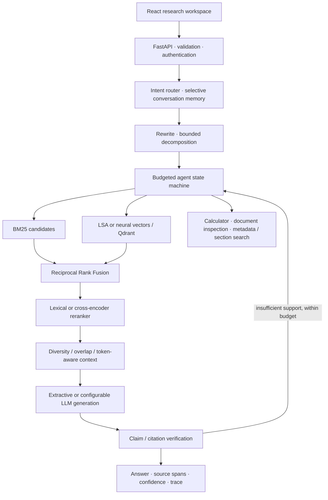
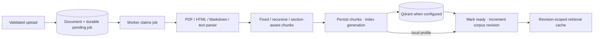

# Architecture and engineering decisions

## Two execution profiles

**Local:** SQLite, a durable database-backed ingestion queue, in-process cache,
BM25, corpus-fitted latent semantic analysis (TF–IDF + truncated SVD), a lexical
reranker, and an extractive evidence writer. It runs without API keys or model
downloads. LSA is a real dense baseline, but is not a pretrained neural embedding.
Lexical reranking is not a cross-encoder. This distinction must remain visible in
the UI, API, and benchmark metadata.

**Service deployment:** PostgreSQL is authoritative; Redis handles caching and
Celery transport; Qdrant holds vectors from a configured sentence-transformers
model; a cross-encoder reranks; a configurable HTTP chat-completion adapter can
call a hosted API or a local compatible model server. The extractive writer is
also available in this profile. Neural weights are optional and must be pinned
before a reproducible production experiment.

## Query path

## Ingestion path

PostgreSQL / SQLite records are authoritative. Queries select ready documents only.
The durable job record is created in the same transaction as the document. A
periodic worker scan recovers missed queue notifications. Job claims use a lease;
retries replace chunk records deterministically. A document is ready only after
its configured index writes succeed. External vector writes are idempotent and
queries filter against the current database snapshot. Deletion marks records
unavailable before best-effort external cleanup; stale vectors cannot become sources.

## Interfaces and boundaries

Core Pydantic contracts describe documents, immutable evidence, filters, queries,
citations, traces, and responses. Provider protocols separate embeddings, dense
search, reranking, generation, and cache operations from orchestration. Neither
the agent nor the API imports a commercial provider SDK.

The agent is a finite workflow with recorded actions, a monotonic deadline, a
maximum number of actions, and token/cost limits. Text from a retrieved document
cannot select a tool or change a tool schema. The calculator accepts a small AST
allowlist; document tools operate only on the indexed corpus. No arbitrary URL
fetch, code execution, shell access, or autonomous external messaging is exposed.

## Storage and cache consistency

Document and chunk IDs are stable UUIDs. Chunk records preserve document ID,
section, page, source, timestamps, and source text. Every corpus mutation advances
a persistent revision. Retrieval keys include revision, query, filters, provider
identity, and retrieval configuration. A query uses one snapshot throughout.
In-memory BM25 / LSA indexes are per-process revision snapshots: useful at portfolio
scale, expensive to rebuild at large corpus sizes. Move sparse retrieval behind
the same interface to OpenSearch when measurements justify that change.

## Security and reliability

Single trusted workspace first; tenant isolation is explicitly out of scope.
Deployment requires an API key, explicit allowed origins, TLS at an ingress, and
private infrastructure networks. Upload size and extension / content checks run
before parsing. Documents are treated as evidence, never as instructions. Provider
failures return typed, sanitized errors with request IDs. Deadline/cost exhaustion
returns a clear error, not a fabricated answer. Health and dependency readiness
are separate. Raw questions, evidence, secrets, and provider error bodies are not
written to request logs.

Grounding initially uses conservative exact evidence spans for extractive answers
and a lexical claim-support check for generated answers. Lexical overlap is not
proof of entailment; it can miss negation and subtle contradictions. Unverified
claims must not be presented as confidently supported. A neural entailment / judge
adapter is a later improvement, not an implied capability.

## Measurement before claims

Every experiment records corpus hash, dataset hash, configuration, profile, model
identity, measured timing, and environment. Retrieval metrics are implemented
directly; generation proxy metrics are explicitly named as proxies. No external
LLM judge score is implied. Small synthetic demo results demonstrate the harness,
not generalization or production service-level objectives.

## Infrastructure sources

- [FastAPI lifespan](https://fastapi.tiangolo.com/advanced/events/) informs resource
  initialization and shutdown.
- [Docker Compose dependency conditions](https://docs.docker.com/compose/how-tos/startup-order/)
  govern database startup and migration ordering; application probes still handle
  failures after startup.
- [Qdrant deployment](https://qdrant.tech/documentation/operations/distributed_deployment/)
  is the reference for a later distributed topology. The initial Compose stack is
  single-node development infrastructure, not a high-availability deployment.
